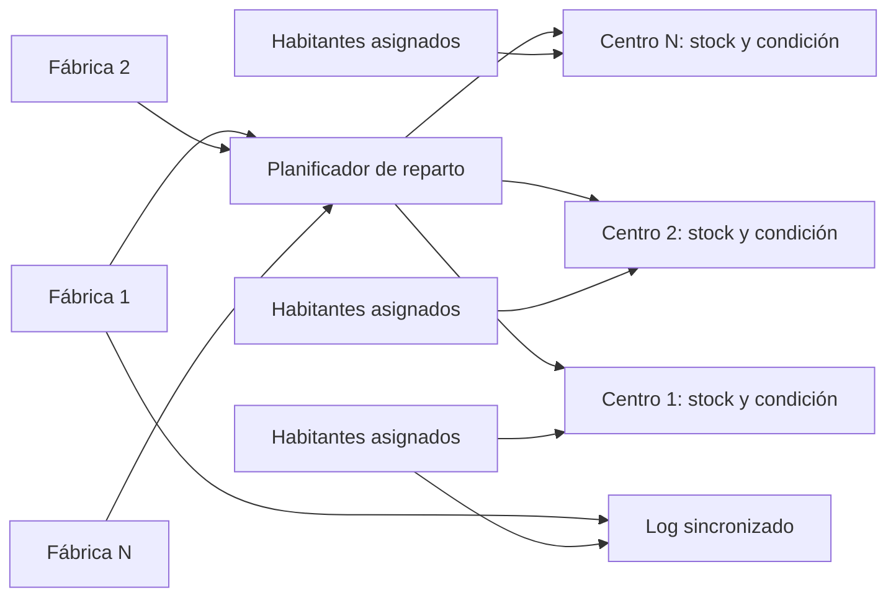
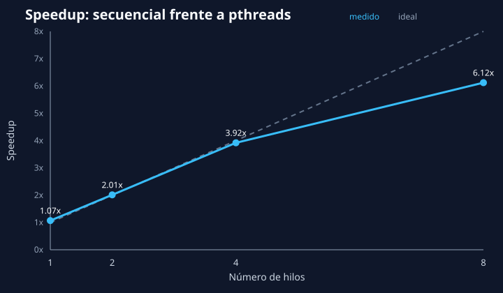

# Simulación de vacunación con pthreads

Simulación concurrente en C11 de una campaña de vacunación. Las fábricas producen y reparten dosis mientras los habitantes esperan en su centro mediante variables de condición. El proyecto pone el foco en invariantes, propiedad de los datos, prevención de carreras y comprobación automatizada, no solo en crear hilos.

## Ejecución rápida

```bash
cmake -S . -B build -DCMAKE_BUILD_TYPE=Release
cmake --build build
./build/practica2 entrada.example.txt salida.txt
```

También se admite:

```bash
./build/practica2                          # entrada.txt -> salida.txt
./build/practica2 resultado.txt            # entrada.txt -> resultado.txt
./build/practica2 config.txt resultado.txt # rutas explícitas
```

El progreso aparece en pantalla y en el fichero de salida. El resumen final comprueba vacunas producidas/recibidas, habitantes vacunados, demanda pendiente y stock sobrante.

## Modelo concurrente



- Cada fábrica tiene un hilo productor y estado privado (`vacunas_fabricas`, asignación y entregas).
- Cada habitante se ejecuta en un hilo, creado en tandas para limitar concurrencia simultánea.
- Cada centro encapsula stock, demanda, contadores, un mutex y una variable de condición.
- Un habitante sin stock ejecuta `pthread_cond_wait`: libera atómicamente el mutex y duerme hasta una entrega.
- Una fábrica actualiza stock bajo el mutex del centro y despierta a los consumidores con `pthread_cond_broadcast`.

## Recursos compartidos e invariantes

| Recurso | Protección | Invariante |
| --- | --- | --- |
| `Centro_t.stock_actual`, demanda y contadores | `centro[i].mutexCentro` | El stock no es negativo y cada vacunación reduce stock y demanda exactamente una vez. |
| Selección global de destinos | `mutexReparto` | Dos fábricas no calculan simultáneamente sobre la misma fotografía de demanda/stock. |
| `rand()` | `mutexAleatorio` | La función global no se ejecuta concurrentemente. |
| `stdout` y fichero de log | `mutexSalida` | Cada evento se escribe completo y en el mismo orden en ambos destinos. |
| Espera por dosis | `condicion_vacunas` + mutex del centro | La condición se verifica siempre dentro de un `while`, tolerando despertares espurios. |

El orden de adquisición es `mutexReparto -> mutexCentro -> mutexSalida`. Ningún camino toma esos locks en orden inverso; esto evita esperas circulares. Los habitantes liberan el mutex del centro antes de registrar su evento.

### Carreras evitadas

- Sin el mutex de centro, una entrega y una vacunación podrían perder actualizaciones de stock.
- Sin proteger `demanda_pendiente`, varias fábricas podrían tomar decisiones con lecturas inconsistentes.
- Sin mutex de salida, dos llamadas a `vfprintf` podrían intercalar líneas y corromper el log lógico.
- `rand()` mantiene estado global; serializarlo evita una carrera dentro de la biblioteca C.
- Las estadísticas solo se calculan después de hacer `pthread_join` a todos los productores y consumidores, estableciendo la relación *happens-before* necesaria.

Todos los retornos de `pthread_mutex_*`, `pthread_cond_*` y `pthread_join` se comprueban. Los fallos recuperables de `pthread_create` generan un cierre ordenado; una violación inesperada de una primitiva de sincronización se informa y aborta para no continuar con estado posiblemente corrupto.

## Formato de entrada

El fichero contiene exactamente nueve enteros:

```text
habitantes_totales
vacunas_iniciales_por_centro
minimo_vacunas_fabricadas_por_tanda
maximo_vacunas_fabricadas_por_tanda
tiempo_minimo_fabricacion
tiempo_maximo_fabricacion
tiempo_maximo_reparto
tiempo_maximo_cita
tiempo_maximo_desplazamiento
```

Los tiempos se expresan en segundos. Se rechazan campos ausentes, datos adicionales, habitantes no positivos, vacunas negativas, rangos invertidos y tiempos negativos.

## Compilación y pruebas

Con Make:

```bash
make
make test
```

Con CMake/CTest:

```bash
cmake -S . -B build -DCMAKE_BUILD_TYPE=Debug
cmake --build build
ctest --test-dir build --output-on-failure
```

La suite recompila la simulación con `FABRICAS=1`, `2`, `4` y `8`; comprueba que los 17 habitantes terminan vacunados, cubre el caso límite de un solo habitante y verifica el rechazo de entradas con campos extra.

### Sanitizers y Valgrind

```bash
cmake -S . -B build-asan -DENABLE_SANITIZERS=ON -DCMAKE_BUILD_TYPE=Debug
cmake --build build-asan
ctest --test-dir build-asan --output-on-failure

cmake -S . -B build-tsan -DENABLE_THREAD_SANITIZER=ON -DCMAKE_BUILD_TYPE=Debug
cmake --build build-tsan
ctest --test-dir build-tsan --output-on-failure -R simulation
```

AddressSanitizer/UBSan y ThreadSanitizer se activan por separado porque sus runtimes no son compatibles entre sí. GitHub Actions ejecuta ambos perfiles, la matriz GCC/Clang y una comprobación adicional con Valgrind (`--leak-check=full --track-fds=yes`).

## Benchmark y speedup

Los `sleep` de la simulación representan latencia humana/logística y no sirven para medir escalado de CPU. Por eso `benchmark.c` aísla una fase determinista de procesamiento de registros, ejecuta exactamente el mismo trabajo secuencial y particionado entre pthreads, y valida ambos resultados mediante checksum.

```bash
./benchmark --threads 4 --items 3000000 --rounds 30
make benchmark-run
```

`make benchmark-run` mide 1, 2, 4 y 8 hilos, guarda `benchmarks/results.csv` y genera la gráfica SVG únicamente con herramientas estándar. Los resultados versionados son una muestra obtenida en una máquina concreta; deben regenerarse para comparar otro hardware.



Muestra actual:

| Hilos | Secuencial | Paralelo | Speedup |
| ---: | ---: | ---: | ---: |
| 1 | 0.451 s | 0.422 s | 1.07x |
| 2 | 0.422 s | 0.210 s | 2.01x |
| 4 | 0.420 s | 0.107 s | 3.92x |
| 8 | 0.417 s | 0.068 s | 6.12x |

## Estructura

```text
.
├── practica2.c
├── benchmark.c
├── entrada.txt
├── entrada.example.txt
├── tests/
├── scripts/
├── benchmarks/
├── CMakeLists.txt
├── Makefile
└── .github/workflows/ci.yml
```
